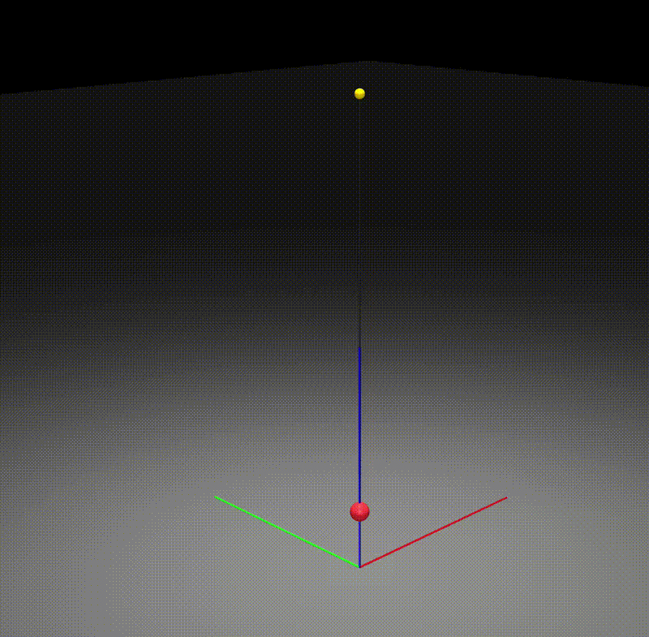

# Rope Simulation Library

一个简单易用的绳索物理仿真库，基于 Position-Based Dynamics (PBD) 和 Verlet 积分实现，使用 MuJoCo 作为可视化后端。

A simple and easy-to-use rope physics simulation library, implemented with Position-Based Dynamics (PBD) and Verlet integration, using MuJoCo as the visualization backend.



## 特点

- **简单**：API 设计简洁，易于理解和使用
- **分离**：物理引擎与可视化完全分离
- **高效**：使用 NumPy 进行数值计算，性能优异
- **可拓展**：模块化设计，支持功能扩展
- **真实感**：基于 PBD 算法，模拟效果逼真

## 安装

### 前置要求

- Python 3.8+
- MuJoCo 物理引擎（>=3.0.0）
- NumPy
- GLFW（用于图形窗口）

### 安装步骤

```bash
# 使用 pip 安装依赖
pip install mujoco numpy glfw

# 克隆项目
git clone <repository-url>
cd rope-sim

# 安装包（可选）
pip install -e .
```

## 快速开始

### 简单绳索示例

```python
import numpy as np
from rope_sim import RopePhysics, RopeVisualizer


# 创建物理引擎
initial_anchor = np.array([0.0, 0.0, 10.0])
rope = RopePhysics(anchor=initial_anchor, length=10.0, segment_length=0.1)

# 创建可视化器
visualizer = RopeVisualizer(rope, title="Simple Rope")

# 仿真循环
while visualizer.is_running():
    anchor = np.array([0.0, 0.0, 10.0])
    rope.set_anchor(anchor)
    rope.step(0.01)
    visualizer.update(anchor)
    visualizer.render()

visualizer.shutdown()
```

### 起重机演示

```bash
python main.py
```

控制方式：
- `A / D` 控制轨道 Y 轴
- `W / S` 控制小车 X 轴
- `Q / E` 控制绳索伸长/缩短
- `R / T` 控制锚点升降
- 鼠标左键拖动 → 旋转视角
- 鼠标右键拖动 → 平移视角
- 滚轮 → 缩放
- `ESC` → 退出

## API 文档

### RopePhysics

```python
class RopePhysics:
    """绳索物理引擎类。"""

    def __init__(
        self,
        anchor,
        length: float = 10.0,
        segment_length: float = 0.1,
        gravity: tuple = (0.0, 0.0, -9.81),
        iterations: int = 8
    ):
        pass

    def set_anchor(self, anchor):
        """设置绳索起点锚点。"""
        pass

    def step(self, dt: float):
        """物理引擎步进。"""
        pass

    @property
    def end_point(self):
        """获取绳索终点位置。"""
        pass

    @property
    def positions(self):
        """获取所有点的位置。"""
        pass
```

### RopeVisualizer

```python
class RopeVisualizer:
    """绳索可视化器类。"""

    def __init__(self, rope_physics, window_size=(1280, 720), title="Rope Simulation"):
        pass

    def update(self, anchor):
        """更新可视化状态。"""
        pass

    def render(self):
        """渲染一帧。"""
        pass

    def is_running(self):
        """检查是否需要继续运行。"""
        pass

    def shutdown(self):
        """关闭可视化器。"""
        pass

    def get_key_state(self, key):
        """获取键盘按键状态。"""
        pass
```

## 架构设计

项目采用模块化设计，分为以下核心模块：

1. **physics.py**：纯物理计算，无可视化代码
2. **visualization.py**：MuJoCo 渲染和用户交互
3. **utils.py**：工具函数（四元数、XML 生成等）
4. **examples/**：示例代码

## 原理

使用 Position-Based Dynamics (PBD) 算法：
1. Verlet 积分预测位置
2. 距离约束迭代求解
3. 最小化求解器优化结果

## 未来计划（可能会）

- [ ] 添加碰撞检测和响应
- [ ] 支持多种绳索材质
- [ ] 优化性能（GPU 加速）
- [ ] 添加更多示例场景
- [ ] 完善文档

## 许可证

MIT License
